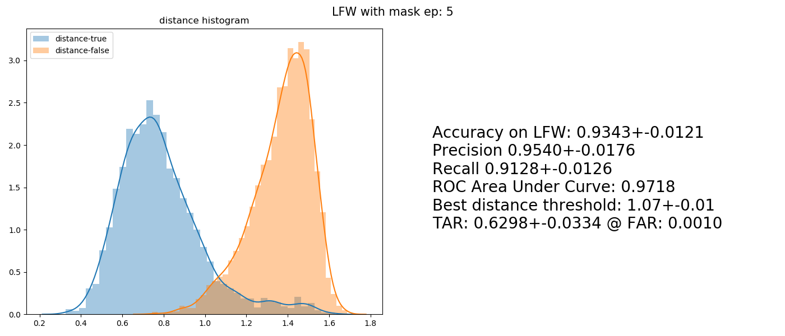

# **FaceNet Pytorch Trainer with Mask Augmentation**

Train [FaceNet](https://github.com/timesler/facenet-pytorch) (InceptionResNet v1) on faces wearing a mask augmentation
with combination loss (Triplets and Cross-Entropy).

This train FaceNet by transfer learning the pre-trained to adap with masked faces for use as features extraction in 
face recognition model or application.

## Prerequisites

- python
- pytorch
- dlib
- opencv
- sklearn
- pandas

## Pre-Trained Models

MTCNN face detection model (optional) or use HOG method.
- [rnet](https://drive.google.com/file/d/12tSRNAdAaiYZq6dVqGCaLorqm366WTJm/view?usp=sharing),
  [pnet](https://drive.google.com/file/d/1aZHfcGghEJH2ngk-tnRTAFhXoZr1JtjD/view?usp=sharing), 
  [onet](https://drive.google.com/file/d/1m80Xd_PNhnZYYUHaah411Nxe2qIOeWCe/view?usp=sharing)
  
Face shape 68 predictor
- [shape_predictor_68_face_landmarks](https://drive.google.com/file/d/1my0izMAWl4XFl-6WwctYqFd7OWPzg0CD/view?usp=sharing)

FaceNet pre-trained on CASIA-webface
- [20180408-102900](https://drive.google.com/uc?export=download&id=12DYdlLesBl3Kk51EtJsyPS8qA7fErWDX)

## Dataset

For training use CASIA-webface or any face dataset to train.
- Since the homepage has gone I can't provide a link, But there a lot other link on the internet.

For evaluation use LFW and [LFW_pairs.txt](./Data/LFW/LFW_pairs.txt) as test data.
- [lfw-deepfunneling](http://vis-www.cs.umass.edu/lfw/lfw-deepfunneled.tgz)

Create masked face dataset on both train and test data.
  
    ./create_masked_face_dataset.py
**Edit the path in code.

## How to wear a mask

  
  

  

Use face detection and face shape to get face landmark select the triangle pieces coordinate to warp the correlate
pieces on the mask image to put into the face image.

As for the triangular piece selection process, it is a manual process. If you want to edit or add new mask image
you need to select the face landmark point index and (x, y) position on mask image then add to FaceMasking.py code.

## Evaluation

  

Histogram distribution of distance prediction of masked LFW face pairs data. (blue is the distance of the same person's 
face pair, red is the distance of the different person's face pair).

Note: This is not the best model. training on CASIA-webface used a lot of time, So I didn't do many tests on this model.