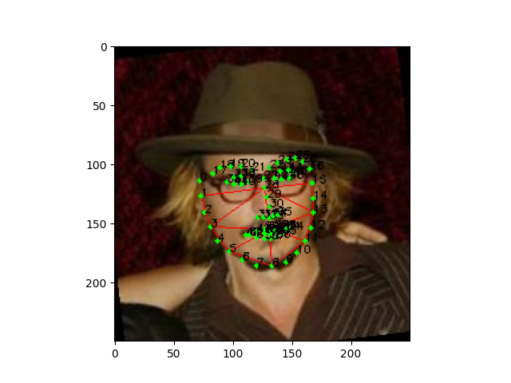
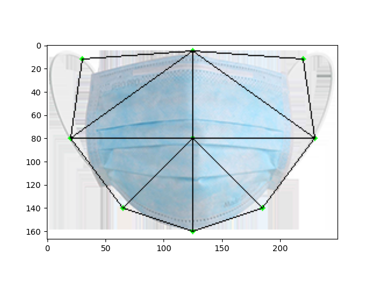
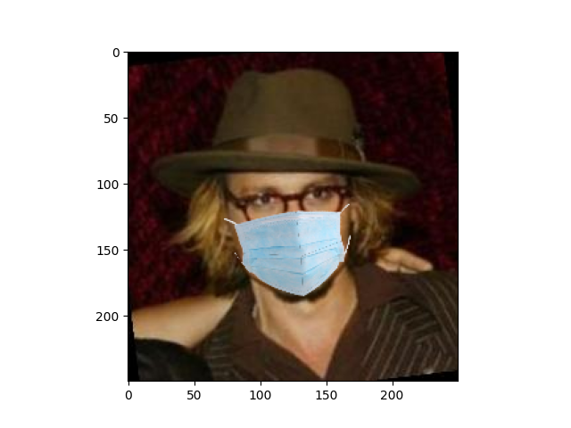

# **FaceNet Pytorch Trainer with Mask Augmentation**

Train [FaceNet](https://github.com/timesler/facenet-pytorch) (InceptionResNet v1) on faces wearing a mask augmentation
with combination loss (Triplets and Cross-Entropy).

This train FaceNet by transfer learning the pre-trained to adap with masked faces for use as features extraction in 
face recognition model or application.

## Prerequisites

- python
- pytorch
- dlib
- opencv
- sklearn
- pandas

## Pre-Trained Models

MTCNN face detection model (optional) or use HOG method.
- [rnet](https://drive.google.com/file/d/12tSRNAdAaiYZq6dVqGCaLorqm366WTJm/view?usp=sharing),
  [pnet](https://drive.google.com/file/d/1aZHfcGghEJH2ngk-tnRTAFhXoZr1JtjD/view?usp=sharing), 
  [onet](https://drive.google.com/file/d/1m80Xd_PNhnZYYUHaah411Nxe2qIOeWCe/view?usp=sharing)
  
Face shape 68 predictor
- [shape_predictor_68_face_landmarks](https://drive.google.com/file/d/1my0izMAWl4XFl-6WwctYqFd7OWPzg0CD/view?usp=sharing)

FaceNet pre-trained on CASIA-webface
- [20180408-102900](https://drive.google.com/uc?export=download&id=12DYdlLesBl3Kk51EtJsyPS8qA7fErWDX)

## How to wear a mask

  
  

  

